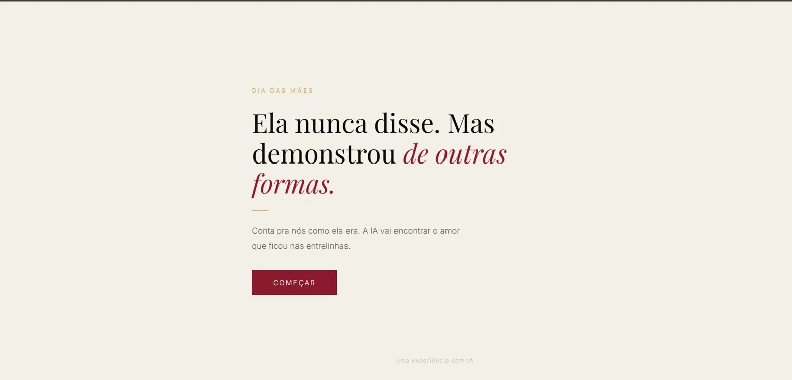
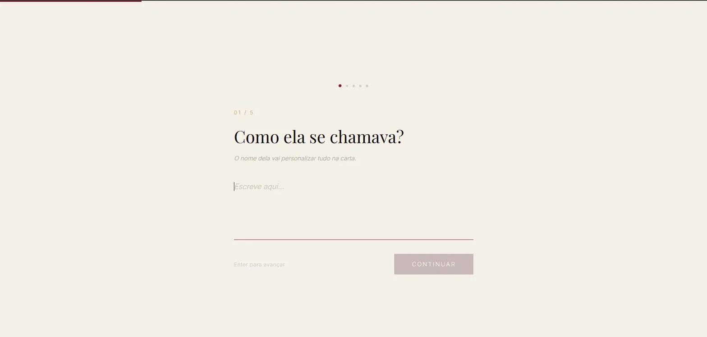
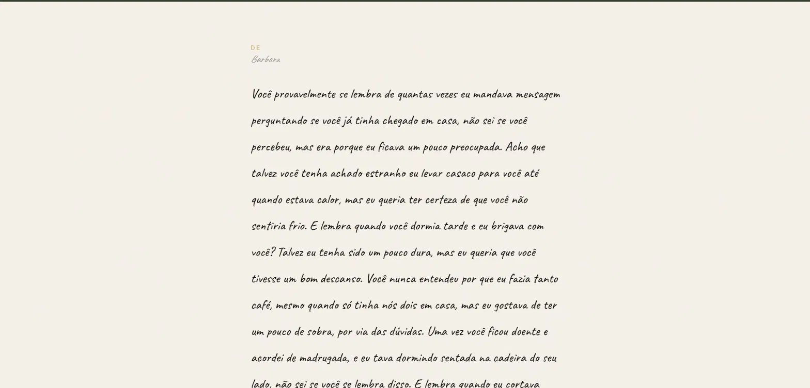
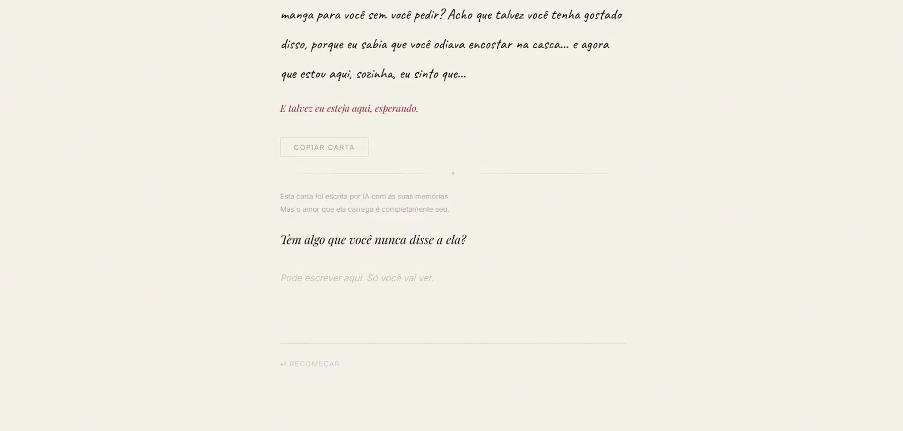

# Como Ela Me Via

> *Ela nunca disse. Mas demonstrou de outras formas.*
> 🥉 3º lugar — Hackathon Dia das Mães 2026 · Servidor dos Programadores

Experiência emocional com IA criada para o Dia das Mães, pensada para quem perdeu a mãe e passa essa data sentindo falta.

O usuário responde cinco perguntas sobre ela. A IA transforma essas memórias em uma carta escrita na voz da própria mãe — contida, humilde e verdadeira. Não é um app de memorial. É uma tradução do amor que ela nunca soube nomear.

## Acesse o projeto

🔗 [como-ela-me-via.vercel.app](https://como-ela-me-via.vercel.app)
---

## Demo

---

## A experiência

Landing → Perguntas → Processando → Carta → Gesto final

1. **Landing** — abertura emocional com headline e colagem afetiva
2. **Perguntas** — cinco etapas em texto livre, uma por vez, com progresso visual
3. **Processando** — frases animadas enquanto a IA escreve a carta
4. **Carta** — texto aparece palavra por palavra, em fonte manuscrita, com foco gradual
5. **Gesto final** — espaço privado para escrever o que nunca foi dito

---

## Galeria

### Landing

### Perguntas

### Processando

### Carta

### Gesto Final

---

## O que a IA faz

- Lê as cinco respostas do usuário
- Gera uma carta na voz da mãe, em primeira pessoa
- Usa os detalhes específicos de cada memória — nunca é genérica
- Mantém tom contido, sem clichês sentimentais
- Nunca afirma emoções diretamente — usa "talvez", "acho que", "não sei se você percebeu"

---

## Stack

- React + TypeScript + Vite
- CSS Modules
- Framer Motion
- Groq API — modelo llama-3.3-70b-versatile

---

## Como rodar localmente

git clone https://github.com/marialuisasanches/como-ela-me-via.git
cd como-ela-me-via
npm install
cp .env.example .env.local
npm run dev

Acesse http://localhost:5173

---

## Variáveis de ambiente

VITE_GROQ_KEY=sua_chave_groq_aqui

---

## Licença

Distribuído sob a licença [MIT](LICENSE).

---

## Autoria

Feito por **Maria Luísa Sanches** para o Hackathon Dia das Mães 2026.
